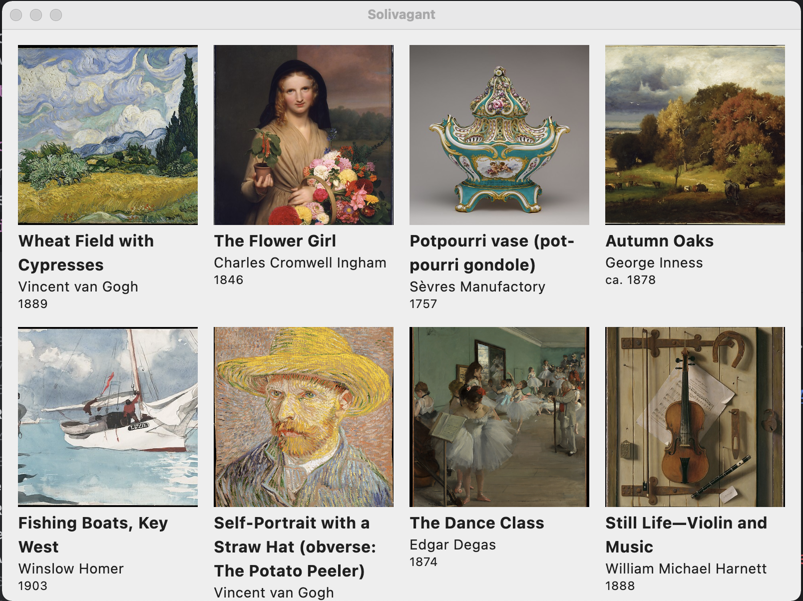
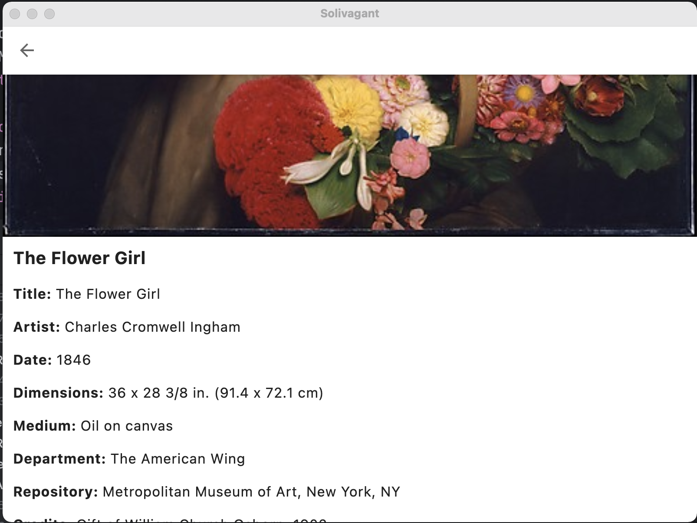

# Kotlin Compose Multiplatform app template

This is a basic Kotlin Compose Multiplatform app template for Android, iOS, and Desktop.
It includes shared business logic and data handling, and a shared UI implementation using Compose Multiplatform.

  

### Technologies

The data displayed by the app is from [The Metropolitan Museum of Art Collection API](https://metmuseum.github.io/).

The app uses the following multiplatform dependencies in its implementation:

- [Compose Multiplatform](https://jb.gg/compose) for UI
- [Ktor](https://ktor.io/) for networking
- [kotlinx.serialization](https://github.com/Kotlin/kotlinx.serialization) for JSON handling
- [Kamel](https://github.com/Kamel-Media/Kamel) for image loading
- [Koin](https://github.com/InsertKoinIO/koin) for dependency injection
- [Solivagant](https://github.com/hoc081098/solivagant) for type-safe navigation, ViewModel, SavedStateHandle, Lifecycle, Multi-Backstacks, Transitions, Back-press handling.

### How
See https://github.com/hoc081098/KMP-App-Template-solivagant/compare/0afc98f07be28ffc92a91ef9198c1e36e2f80374...b67c85134392debd4fe4988fee0e5b30312e8f0a
